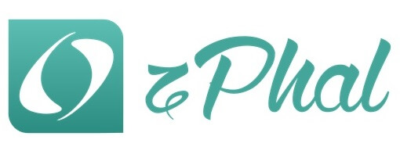

    

    
    
    

------------

# zPhal

Open-sourced blog system for building high performance experience base on Phalcon framework.

基于Phalcon开发的开源博客系统，高性能、低耦合、可拓展。

**building...**   
**开发中..**

## Requirements
* PHP 7.0+
* Phalcon 3.0.0+
* MySQL
* Nginx or Apache
* Redis
* Composer

## Installation
### Composer
...

### Webserver
...

### Database
...

### Features
