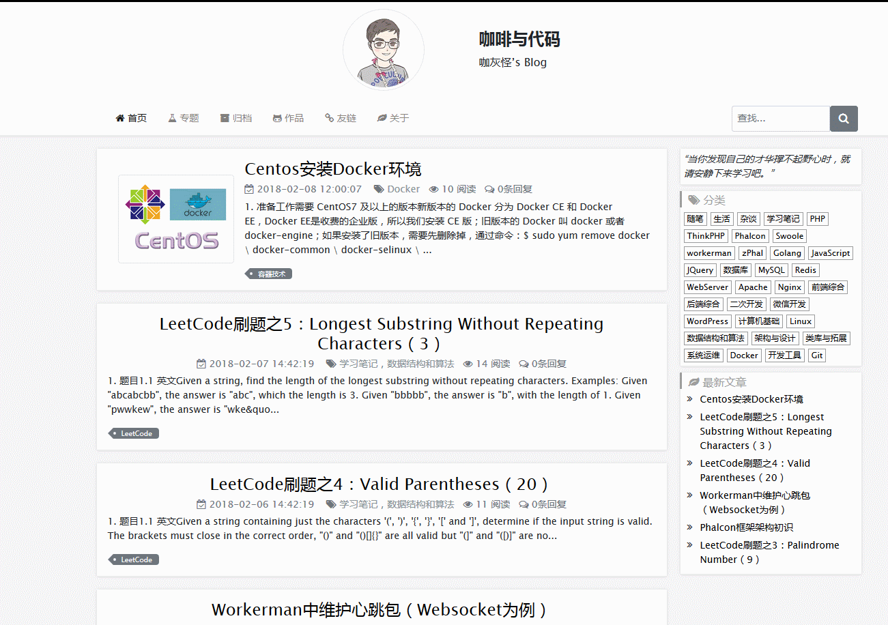

<p align="center">
    
</p>

<p align="center">
    <a href='https://secure.php.net/'></a>
    <a href='https://phalconphp.com/'></a>
    
</p>

------------

# zPhal介绍

Open-sourced blog system for building high performance experience base on Phalcon framework.

基于Phalcon开发的开源博客系统。



------------

# 运行环境
## 环境要求
* PHP 7.0+
* Phalcon 3.0.0+
* MySQL
* Nginx or Apache
* Redis
* Composer

## 使用Docker搭建环境（推荐）
因为依赖Redis等，推荐用Docker统一进行管理，更加方便。   
这里有ZPhal对应的docker-file供参考：https://github.com/ZpGuo/zPhal-dockerfiles

------------

## 安装
### 下载
下载项目release的压缩文件或者clone项目。

### 运行Composer
项目依赖composer；进入项目根目录，执行：
```
composer update
```

### 导入数据库
创建数据库，并导入初始数据库；SQL文件位于schema目录下，zphaldb.sql。

### 环境配置
复制根目录下的.env.example文件并命名为.env文件；打开文件，修改配置为你环境对应的配置。

### Webserver配置
webserver可以使用Apache或者nginx。

Apache服务器；项目中已经有.htaccess文件；

对于Nginx服务器，下面是一个供参考的配置：
```
server {
    listen        80;
    server_name www.zphal.com zphal.com;

    ##########################
    # In production require SSL
    # listen 443 ssl default_server;

    # ssl on;
    # ssl_session_timeout  5m;
    # ssl_protocols  SSLv2 SSLv3 TLSv1;
    # ssl_ciphers  ALL:!ADH:!EXPORT56:RC4+RSA:+HIGH:+MEDIUM:+LOW:+SSLv2:+EXP;
    # ssl_prefer_server_ciphers   on;

    # These locations depend on where you store your certs
    # ssl_certificate        /var/nginx/certs/default.cert;
    # ssl_certificate_key    /var/nginx/certs/default.key;
    ##########################

    root /data/www/zPhal/public;
    index index.php index.html index.htm;

    charset utf-8;
    client_max_body_size 100M;
    fastcgi_read_timeout 1800;

    location / {
        # Matches URLS `$_GET['_url']`
        try_files $uri $uri/ /index.php?_url=$uri&$args;
    }

    location ~ \.php$ {
        try_files $uri =404;

        #fastcgi_pass  unix:/var/run/php/php7.0-fpm.sock;
        fastcgi_pass  php-fpm:9000;

        fastcgi_index /index.php;

        include fastcgi_params;
        fastcgi_split_path_info       ^(.+\.php)(/.+)$;
        fastcgi_param PATH_INFO       $fastcgi_path_info;
        fastcgi_param PATH_TRANSLATED /data/www/zPhal/public/$fastcgi_path_info;
        fastcgi_param SCRIPT_FILENAME /data/www/zPhal/public/$fastcgi_script_name;
    }

    location ~ /\.ht {
        deny all;
    }

    location ~* \.(js|css|png|jpg|jpeg|gif|ico)$ {
        expires       max;
        log_not_found off;
        access_log    off;
    }
}
```

## 开始使用
一切准备就绪，就可以开始使用了。

在项目路劲后加/admin可进入后台登录页面；初始账号为admin，密码为admin（线上环境请不要再使用初始账号，可以在后台进行修改）。
